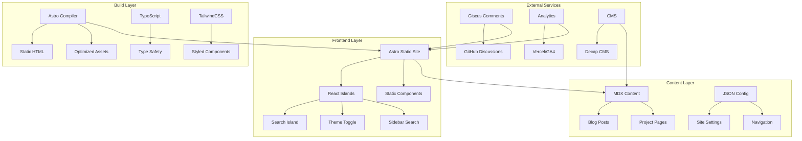
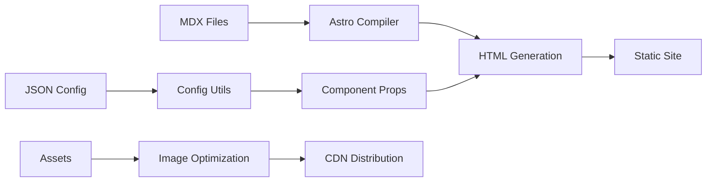
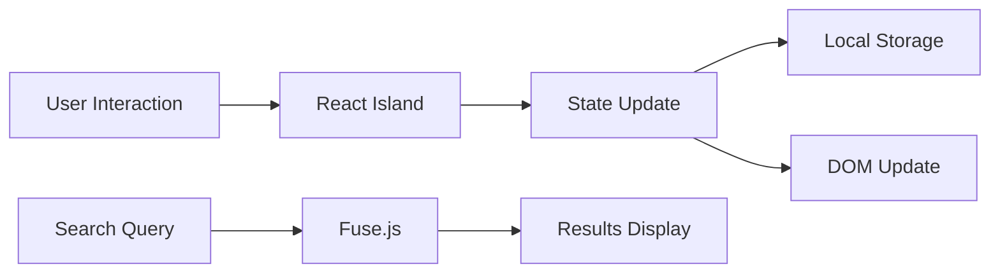
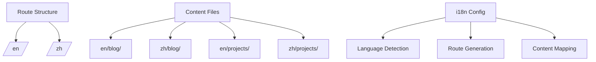

# System Patterns: Product WhoAmI
*Version: 1.0*
*Created: 2025-06-06*
*Last Updated: 2025-06-06*

## Architecture Overview

Product WhoAmI follows a modern **Jamstack architecture** using Astro's **Islands Architecture** pattern. The system is designed as a static site generator with selective hydration for interactive components, optimizing for performance while maintaining rich functionality.

### Core Architectural Principles
- **Static-First**: Generate static HTML for optimal performance and SEO
- **Islands of Interactivity**: Selective hydration only where needed
- **Component-Based**: Modular, reusable components for maintainability
- **Configuration-Driven**: Centralized configuration for easy customization
- **Content-Centric**: MDX-based content management with Git workflow

## System Architecture Diagram

## Key Components

### 1. Content Management Layer
- **MDX Processor**: Handles markdown with React components
- **Content Collections**: Organized blog posts and projects
- **Configuration System**: JSON-based site configuration
- **Asset Management**: Image optimization and static assets

### 2. Presentation Layer
- **Layout System**: Consistent page layouts
- **Component Library**: Reusable UI components
- **Navigation System**: Dynamic navigation with mobile support
- **Theme System**: Dark/light mode with persistence

### 3. Interactive Layer (Islands)
- **Search Island**: Client-side search functionality using Fuse.js
- **Theme Toggle Island**: Theme switching with local storage
- **Sidebar Search Island**: Collapsible sidebar search interface
- **Comment System**: Giscus integration for discussions

### 4. Utility Layer
- **Configuration Utils**: Centralized config access
- **Content Utils**: Content parsing and formatting
- **SEO Utils**: Meta tag and structured data generation
- **Search Utils**: Search indexing and query processing

## Design Patterns in Use

### 1. **Islands Architecture Pattern**
- **Purpose**: Selective hydration for performance
- **Implementation**: React components only hydrate when interactive
- **Benefits**: Faster initial loads, better Core Web Vitals

### 2. **Configuration-Driven Pattern**
- **Purpose**: Easy customization without code changes
- **Implementation**: JSON configuration with TypeScript interfaces
- **Benefits**: Maintainable, extensible, type-safe

### 3. **Content-as-Code Pattern**
- **Purpose**: Version-controlled content management
- **Implementation**: MDX files in Git repository
- **Benefits**: Developer-friendly, reviewable, backupable

### 4. **Static Generation Pattern**
- **Purpose**: Optimal performance and SEO
- **Implementation**: Build-time rendering with Astro
- **Benefits**: Fast loading, CDN-friendly, SEO optimized

### 5. **Component Composition Pattern**
- **Purpose**: Reusable, maintainable components
- **Implementation**: Astro components with slot-based composition
- **Benefits**: DRY principle, consistent UI, easy testing

## Data Flow Architecture

### Content Processing Flow

### Interactive Component Flow

## Component Relationships

### Core Layout Components
- **BaseLayout**: Root layout component
- **Navigation**: Header navigation with mobile support
- **MobileNav**: Collapsible mobile navigation
- **Sidebar**: Contextual sidebar with search and TOC
- **ThemeToggle**: Theme switching interface

### Content Components
- **ArticleCard**: Blog post preview cards
- **ArticleListItem**: List item format for articles
- **RecentPosts**: Recent posts widget
- **TableOfContents**: Auto-generated TOC
- **Comments**: Giscus comment integration

### Search Components
- **SearchIsland**: Main search interface (React)
- **SidebarSearchIsland**: Sidebar search (React)
- **SearchResultCard**: Search result display

## Key Technical Decisions

### 1. **Astro over Next.js/Gatsby**
- **Rationale**: Better performance for content-heavy sites
- **Trade-offs**: Less dynamic capabilities, newer ecosystem
- **Benefits**: Superior Core Web Vitals, simpler deployment

### 2. **Islands Architecture over Full SPA**
- **Rationale**: Optimize performance while maintaining interactivity
- **Trade-offs**: More complex state management across islands
- **Benefits**: Better initial load times, improved SEO

### 3. **MDX over Pure Markdown**
- **Rationale**: Enable rich content with React components
- **Trade-offs**: Slightly more complex content creation
- **Benefits**: Interactive demos, custom layouts, reusable components

### 4. **JSON Configuration over Environment Variables**
- **Rationale**: Type safety and better IDE support
- **Trade-offs**: Build-time configuration only
- **Benefits**: Validated configuration, better DX

### 5. **Client-Side Search over External Service**
- **Rationale**: Faster search, no API costs, offline capable
- **Trade-offs**: Larger bundle size for search index
- **Benefits**: Instant results, privacy-friendly, cost-effective

## Internationalization Architecture

### Planned I18n Structure

### I18n Implementation Strategy
- **Static Route Generation**: Build separate routes for each locale
- **Content Organization**: Language-specific content directories
- **Shared Components**: Language-agnostic UI components
- **Configuration**: Locale-specific site configuration

## Performance Optimization Strategy

### Build-Time Optimizations
- **Static Site Generation**: Pre-rendered HTML for all pages
- **Image Optimization**: Automatic WebP/AVIF conversion with Sharp
- **Code Splitting**: Automatic JavaScript bundling optimization
- **CSS Optimization**: TailwindCSS purging and compression

### Runtime Optimizations
- **Selective Hydration**: Only interactive components hydrate
- **Lazy Loading**: Images and non-critical components
- **Caching Strategy**: Aggressive static asset caching
- **CDN Distribution**: Global content delivery

### Search Performance
- **Index Generation**: Build-time search index creation
- **Fuzzy Search**: Fuse.js for fast client-side search
- **Result Caching**: Cache search results in memory
- **Progressive Enhancement**: Works without JavaScript

## Security Considerations

### Static Site Security
- **No Server Vulnerabilities**: Static hosting eliminates server attacks
- **CSP Headers**: Content Security Policy via hosting provider
- **HTTPS Enforcement**: SSL/TLS encryption required

### Third-Party Integrations
- **Giscus**: GitHub OAuth, moderated discussions
- **Analytics**: Privacy-focused analytics preferred
- **CMS**: Git-based workflow, no database vulnerabilities

## Scalability Architecture

### Content Scalability
- **Build Performance**: Incremental builds for large content volumes
- **Asset Management**: Optimized image processing pipeline
- **Content Organization**: Hierarchical content structure

### Traffic Scalability
- **CDN Distribution**: Global edge caching
- **Static Assets**: Highly cacheable content
- **Search Scalability**: Client-side search scales with CDN

---

*This document captures the system architecture and design patterns used in Product WhoAmI, focusing on performance, maintainability, and developer experience.* 